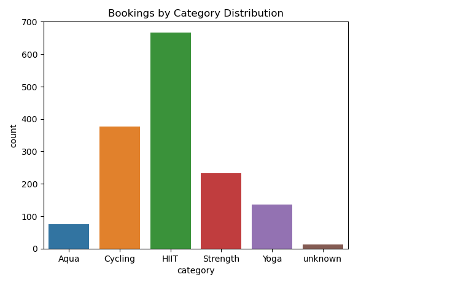
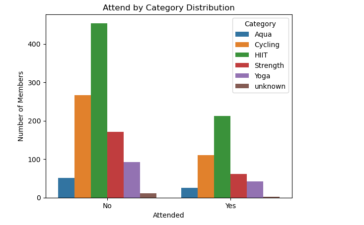
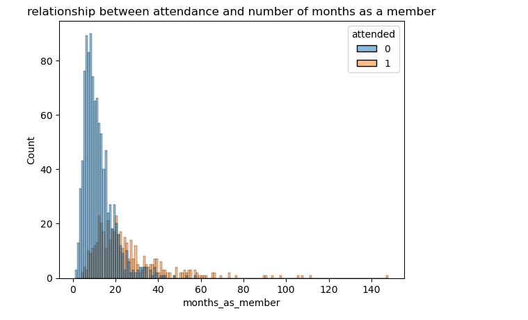

# Fitness Club Attendance & Booking Intelligence

### Project Description
This project delivers a comprehensive data analysis and predictive modeling pipeline designed to evaluate member engagement, class booking behaviors, and attendance patterns at a fitness facility. By examining demographic features, membership tenure, and operational schedules, such as class categories, booking lead times, days of the week, and AM/PM time slots. The analysis uncovers key drivers behind class no-shows. Additionally, it implements classification models to predict whether a member will attend a scheduled session, providing actionable intelligence to optimize facility resource allocation and member retention strategies.

---

## 📊 Visualizations & Key Insights

### 1. Bookings & Attendance by Category
* **HIIT and Cycling** drive the highest overall volume of bookings, making them the most popular fitness classes.
* Attendance distributions show that certain categories experience higher absolute volumes of no-shows relative to their total booking counts.

| Bookings by Category | Attendance by Category |
| :---: | :---: |
|  |  |

---

### 2. Temporal Patterns (Time & Day)
* **Time of Day:** The vast majority of both bookings and actual attendance occur during **AM** sessions compared to PM.
* **Day of the Week:** Fridays and Thursdays show higher booking volumes, though attendance drop-offs vary across different days of the week.

| Attendance by Day of Week | Attendance by Time of Day |
| :---: | :---: |
|  |  |

---

### 3. Member Demographics & Behavior
* **Membership Duration:** Most members have a tenure under 20 months, displaying a sharp right-skewed distribution.
* **Booking Lead Time:** Members typically book classes between 1 to 15 days in advance, with peak clustering around 10 days before class.
* **Weight Distribution:** Member weight follows a roughly normal distribution centered around 75–80 kg.

| Months as Member | Days Before Booking | Member Weight Distribution |
| :---: | :---: | :---: |
|  |  |  |

---

## 🤖 Machine Learning Classification
We trained classification models to predict attendance (`0` = No-show, `1` = Attended). 

* **Model Evaluation (Classification Reports):**
  * **Model Variant 1:** Achieved an overall accuracy of **77%** with strong recall on class 0 (no-shows) at 0.93.
  * **Model Variant 2:** Fine-tuned precision and recall balance, reaching an overall accuracy of **78%** with improved precision on class 1.

| Model Evaluation 1 | Model Evaluation 2 |
| :---: | :---: |
|  |  |

---

## 🛠️ Tech Stack
* **Language:** Python
* **Libraries:** Pandas, NumPy, Scikit-Learn, Seaborn, Matplotlib

---

## 👨‍💻 About Me

**Martins F. Balogun**
Data Scientist & BI Consultant | Machine Learning Practitioner

I specialize in transforming raw datasets into actionable insights through robust statistical analysis, predictive modeling, and interactive business intelligence solutions.

### Connect with me
- LinkedIn: [https://www.linkedin.com/in/mfbalogun](https://www.linkedin.com/in/mfbalogun)
- GitHub: [https://github.com/bmartech](https://github.com/bmartech)
- Email: martinsfriday.mf@gmail.com
